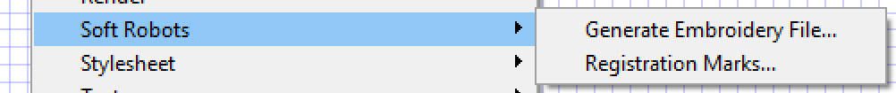

Brian Wagner  
brian@tegrasys.com  
7/6/17

## Inkscape PES extension
This is software for an inkscape extension to generate Brother embroidery machine PES files.

Inkscape is an open source vector drawing program.  You can download and use it for free here: [https://inkscape.org/en/](https://inkscape.org/en/)

Also see process.md to see further instructions.

## About

This extension was written by Brian Wagner during the spring and summer of 2017 for a project at the University of Louisville led by Dr. Cindy Harnett.  Its purpose is to allow the user to design a path (or zigzag) that needs to be sewn using an embroidery machine.  This process will allow the user to embed fibers and tendons on fabric to facilitate soft robotics manufacturing.

## Installation

To install, copy the .py files in the Inkscape\share\extensions folder.  For a Windows machine, this is straight forward.  In my case I copied the .py from the archive to c:\Program Files\Inkscape\share\extensions folder.  For Macs, it is a little more complicated... see this [video https://www.youtube.com/watch?v=StNTZ1xeW0o](video https://www.youtube.com/watch?v=StNTZ1xeW0o)

 Then restart inkscape and then there will be a "soft robotics" menu item in extensions.  This software is still being actively developed and should be in a good solid state by the end of July 2017.

## Manual
This part of the document shows how to use the extension only.  The process of using this extension for useful robotics projects is documented in the process.md file in this archive.

So far this extension has two parts... Generate Embroidery File and Registration marks.  You can get to the extensions by clicking on the Extensions menu item in inkscape.

### Registration marks

Generally the first thing one does is they add the registration marks to the file.  Choose this item to get this screen.

Click apply to add two registration marks to your file.  Internally, these registration marks are labeled R1 and R2 and are on Layer 1.

### Generate Embroidery file

Here is where things get fun!  

First, before clicking on Generate Embroidery File, you have to draw a **path** in inkscape for the extension to work on.  This path also needs to be on Layer 1, which is the default so you should be good.

Draw a test line in inkscape.

**IMPORTANT!** Now select the line and choose Path->Object to path in the inkscape menu.  This ensures the object is a path.  Just about anything can be turned into a path!

Now, leave the line selected, and Click Extensions->Soft Robotics->Generate Embroidery File and you will get this form...

Hopefully the options are somewhat self explanatory.  The first 4 items are the registration offsets of **where the actual needle lines up with your pattern on the embroidery machine**.  So to find these values, you have to follow the instructions in the process.md file and enter the values you find when setting the needle on the registration marks.  See process.md for more information.  

The zigzag stitch and thread offset for zigzag stitch options are for when you want to embroider a zigzag stitch rather than a straight stitch.

The filename and directory text boxes are for entering the folder and filename for the PES file that is being written.  In this picture I use the file inkscape.pes and save it to a folder I created called pesfolder on the c drive (Windows).  I can plug a usb thumb drive into my computer and change the directory to d:\ and save to the USB for easy transfer to the embroidery machine.

**You have to put a \ (Windows) or a / (Mac) at the end of your directory to make it work correctly.** 

The directory for a Mac can be tricky.  Your User folder is /Users/username/  Be sure to put the / at the end.  

More info about Mac file paths here: [https://apple.stackexchange.com/questions/51280/where-do-i-find-my-user-folder-in-the-os-x-folder-hierarchy](https://apple.stackexchange.com/questions/51280/where-do-i-find-my-user-folder-in-the-os-x-folder-hierarchy)

and [https://superuser.com/questions/429058/how-can-i-get-the-mount-path-of-a-usb-device-on-osx](https://superuser.com/questions/429058/how-can-i-get-the-mount-path-of-a-usb-device-on-osx)

Check the Overwrite file to automatically overwrite your file if you want.

Check Debug Messages to pop up debug messages.  I used this feature to copy the actual points (in Python) of the path into other Python programs for development purposes.  If you are familiar with Python, feel free to mess with this, but no promises!  At the end of the debug message is the location of the pes file that was generated.

Finally, click Apply and the extension will generate the pes file specified, in the directory specified.  You can now manually (sneaker net!) move the file to the embroidery machine to sew the path.

Enjoy!
