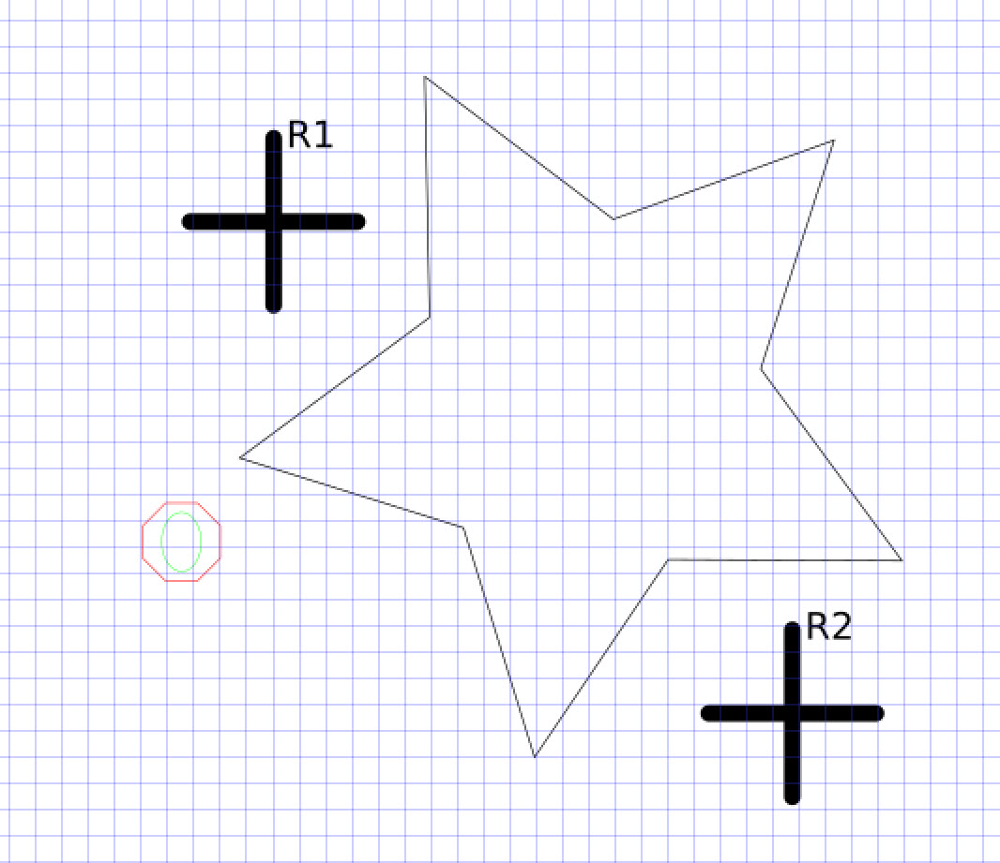
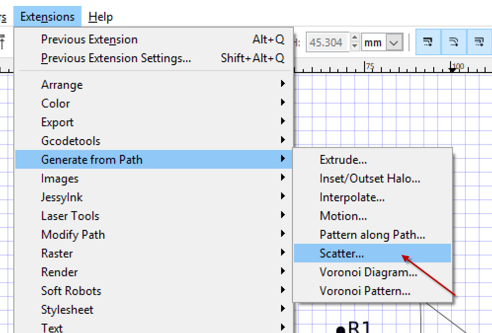
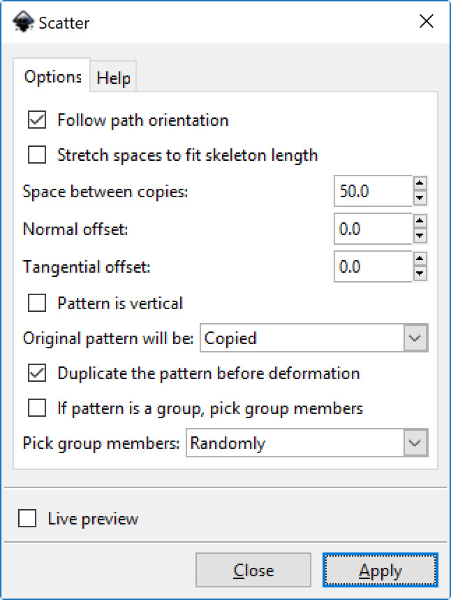
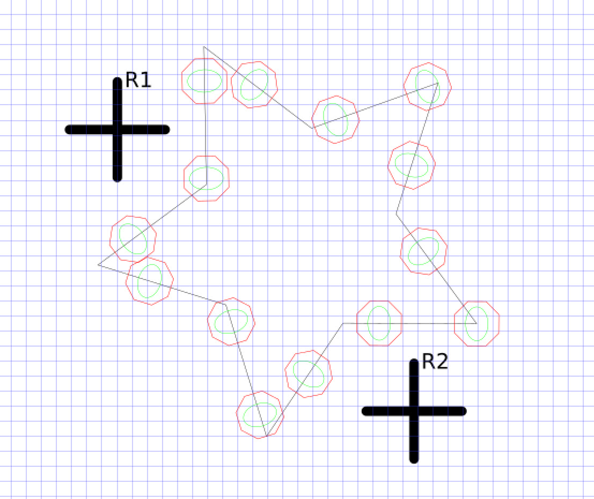
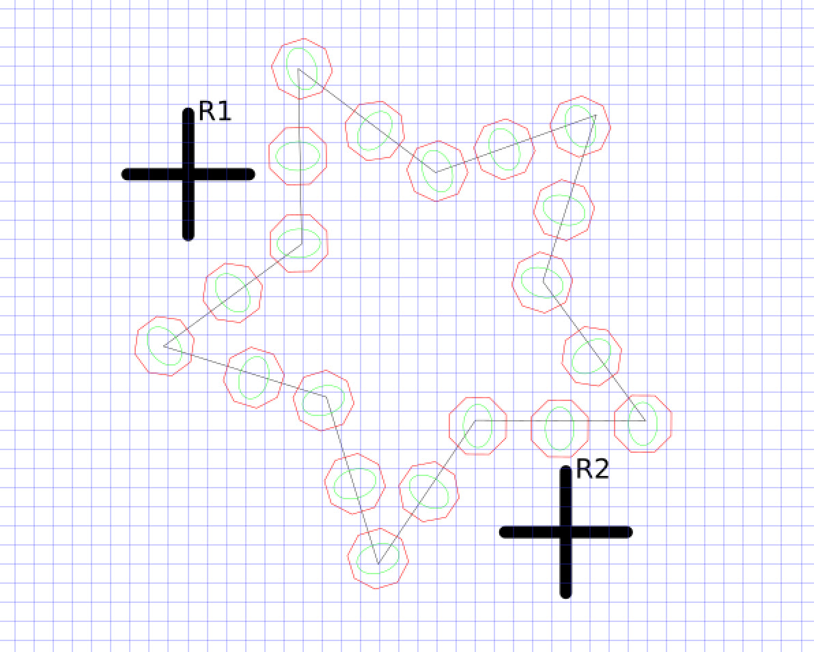
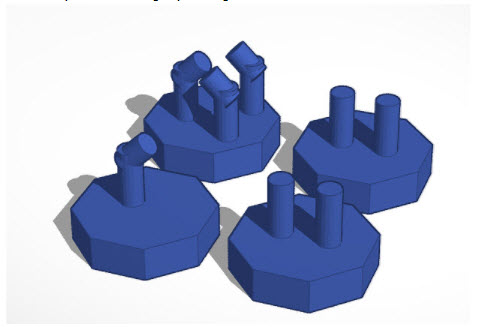
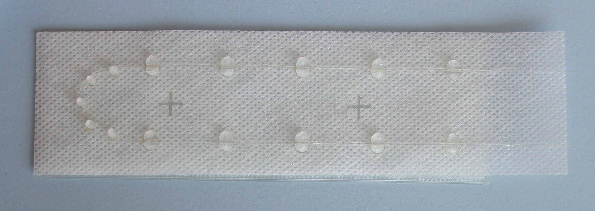
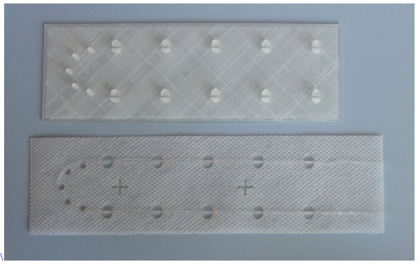

Brian Wagner  
brian@tegrasys.com  
7/6/17

## Lasers, 3D Printers and Embroidery Machines!

The purpose of this document is to show how to use the the Soft Robotics inkscape extensions in conjunction with a laser cutter and a 3d printer to stitch fibers reliably and easily to fabric using an embroidery machine.

## The Process

### Step 1

Use Inkscape to create a stitch design using the directions in README.md.  Add registration marks using the Inkscape extension.  In this example, we are going to stitch a fiber onto a star pattern.  The star is already a path so it does not need to be turned into a path.  

### Step 2

Copy and paste the octagon shape that is in the octagon.svg file in the process_example folder into your inkscape file (in our case, the star file).  At some point, creating these octagons will become part of the inkscape extension.  This octagon shape has sides that are exactly 10mm in length and this matches the 3D printed pegs.  

Inkscape will fit the octagon to the path using the Extensions->Generate from Path->Scatter command.
Select the octagon and the star path and click the command.

Finally, you may want to move/rotate the octagons so they fit your path the best.  You may have to Object->ungroup first.

### Step 3

Print a bunch of octagon pegs using a 3D printer.  The file is OctPegs.stl in this repository.  These pegs are reusable so print a lot!

### Step 4

Prepare the laser cutter!  At this point use your laser to cut a 3mm (1/8") piece of plywood or acrylic to be a template for the octagons.  You may have to change colors to suit your laser, but I cut out all the red octagons.  I also engrave (don't cut all the way through) the black lines for easy inspection.  

Next cut all the green ellipses on the sticky embroidery backer paper.  Also cut the registration marks because you will need them later.  I am not cutting the star because that would mess up the paper.  Also, make sure your paper is upside-down because you will need the sticky side up for the next step.  Think about what you want before you cut!

I am using a Full Spectrum Laser and it works well for this application.

## History

A similar process to this way prototyped by Dr. Cindy Harnett and {name} by creating a 3D printed plate to hold a fiber on on a sticky embroidery backer prior to stitching.  

## New Prototypes

Our new process utilizes 3D printing and laser cutting to layout the fiber for stitching.  It also uses Inkscape as a CAD program to create files that can be used for this process.  Below are some pictures of early protoypes of the new process.

3D printed octagonal pegs to hold fiber.

 This one used pegs made from 3D printer filament to hold the fiber.  It did not work out very well.

